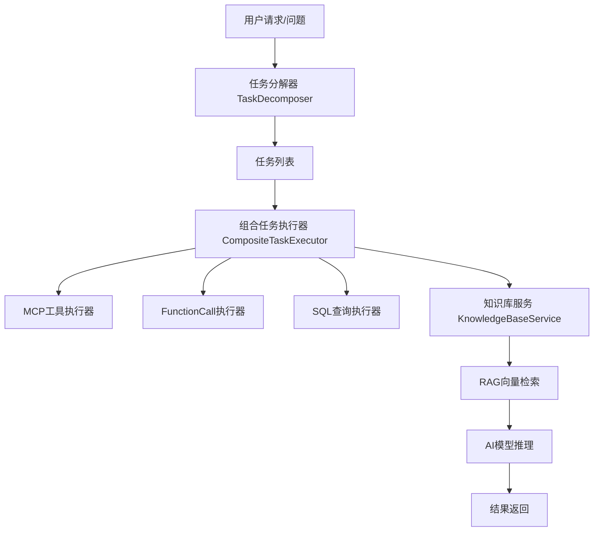

# 项目架构与文档梳理（my-ai-agent）

## 目录结构概览

```
src/main/java/com/yam/myaiagent/
├── advisor/                # 切面与日志相关
├── agent/                  # 智能体核心实现及模型策略
├── app/                    # 业务应用（如面试、恋爱、UI等）
├── chatmemory/             # 聊天记忆存储
├── config/                 # 配置与数据源管理
├── constant/               # 常量定义
├── controller/             # REST API控制器
├── demo/                   # Demo案例
├── model/                  # 数据模型
├── rag/                    # RAG（检索增强生成）相关
├── service/                # 业务服务层
├── taskdecompose/          # 任务分解相关
├── taskexecutor/           # 任务执行器体系
├── tools/                  # 工具集合（如代码分析、PDF、Web搜索等）
```

## 各模块功能说明

- **advisor**：日志、AOP切面等系统层扩展。
- **agent**：AI Agent核心，包括多种模型策略（如DeepSeek、OpenAI、阿里云）、Agent状态管理与ToolCall能力。
- **app**：面向具体业务场景的应用（如Java面试、恋爱问答、UI生成等）。
- **chatmemory**：基于文件的对话历史管理。
- **config**：Spring配置、AI模型配置与数据源管理（PostgreSQL/MySQL）。
- **controller**：对外REST接口，包括AI问答、文件处理、健康检查、知识库管理等。
- **model**：请求/响应DTO，文档对象等数据结构。
- **rag**：RAG流程，文档加载、向量存储、关键词增强、分词、向量检索等。
- **service**：具体业务功能实现，如知识库服务、文件服务等。
- **taskdecompose**：任务分解器与规则管理，支持将复杂问题拆解为可执行子任务。
- **taskexecutor**：多种任务执行器（如MCP工具、FunctionCall、SQL查询等），组合执行分发。
- **tools**：各类工具能力，包括代码分析、PDF生成、Web搜索等。

## 业务主线流程梳理

### 1. 任务分解

由[`TaskDecomposer.java`](src/main/java/com/yam/myaiagent/taskdecompose/TaskDecomposer.java:1)定义接口，负责：
- 将用户输入的问题拆解为具体任务列表
- 支持任务分解规则上传/获取/删除，规则可存储于向量数据库

**接口方法：**
- `List<DecomposedTask> decompose(String question)`
- `String uploadRule(String ruleJson)`
- `List<String> getAllRules()`
- `void deleteRule(String ruleId)`

### 2. 任务执行

由[`CompositeTaskExecutor.java`](src/main/java/com/yam/myaiagent/taskexecutor/CompositeTaskExecutor.java:1)实现：
- 根据任务类型分发给不同的执行器（MCP工具/FunctionCall/SQL查询等）
- 支持扩展与组合执行，默认处理未注册类型

**核心流程：**
- 通过构造自动注册各类执行器
- 使用`executorMap`进行类型-执行器映射
- 日志记录Bean初始化和注册信息

### 3. 知识库与RAG检索

由[`KnowledgeBaseController.java`](src/main/java/com/yam/myaiagent/controller/KnowledgeBaseController.java:1)负责API入口，服务包括：
- Markdown文档上传（自动向量化入库）
- 基于知识库向量检索进行智能问答（支持多模型类型）

**主要接口：**
- `/api/knowledge/upload`：文档上传，入向量存储
- `/api/knowledge/qa`、`/qaNew`：知识库问答，调用知识库服务检索并生成回答

### 4. AI模型与数据源配置

详见[`application.yml`](src/main/resources/application.yml:1)：
- 支持PostgreSQL/MySQL双数据源
- 配置多家大模型API（阿里云DashScope、DeepSeek、OpenAI、Ollama等）
- 可灵活切换模型类型与API KEY

## 项目主流程架构图（Mermaid）



## 参考文档

- [`docs/markdown/【AI项目-my-ai-agent-很好★★★】-梳理&代码.mkd`](docs/markdown/【AI项目-my-ai-agent-很好★★★】-梳理&代码.mkd)
    - 包含大模型账号与API Key说明
    - 多模型（DeepSeek、阿里云）功能、价格与调用细节
    - 相关数据库连接配置参考

## 典型配置文件参考

- [`application.yml`](src/main/resources/application.yml:1)：Spring Boot主配置，AI模型/数据库/服务参数等

## 总结

本项目采用Spring Boot微服务架构，聚合AI Agent、RAG知识库、任务分解/执行等能力，支持多模型推理与智能问答，结构清晰、扩展性强。详细流程可参考Mermaid架构图与各模块功能说明。

如需进一步细化某模块或补充其他流程图，请指定需求。